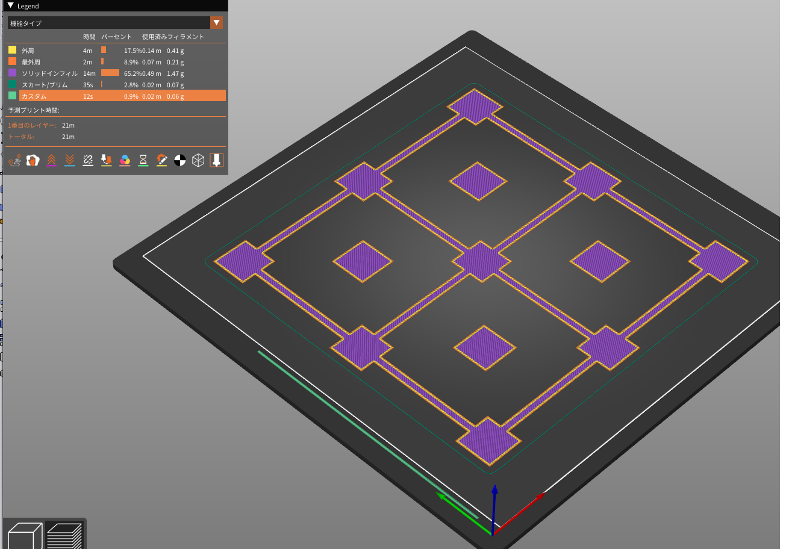

# FDM方式　３Dプリンター用テストデータ
# Test data for FDM method 3D printer

3Dプリンタを調整した後に、正しく印刷が出来るか確認するためのデータです。

This data is used to check whether printing is possible after adjusting the 3D printer.

# Plate_test
 

    - プレートが正常かの確認用 
    - 0.1ｍｍ厚の１層目を作成します。
    - プレートが水平でないと均一に印刷されません
    - 20~30分で印刷が終わります。

    - For checking if the plate is normal
    - Create the first layer with a thickness of 0.1mm.
    - If the plate is not level, it will not print evenly.
    - Printing will be completed in 20-30 minutes.

 
<a property="dct:title" rel="cc:attributionURL" href="https://github.com/nonNoise/3DPrinter_Testdata/tree/main">Test data for FDM method 3D printer</a> by 北神雄太 Yuta Kitagami is licensed under <a href="http://creativecommons.org/licenses/by/4.0/?ref=chooser-v1" target="_blank" rel="license noopener noreferrer" style="display:inline-block;">CC BY 4.0</a>
 